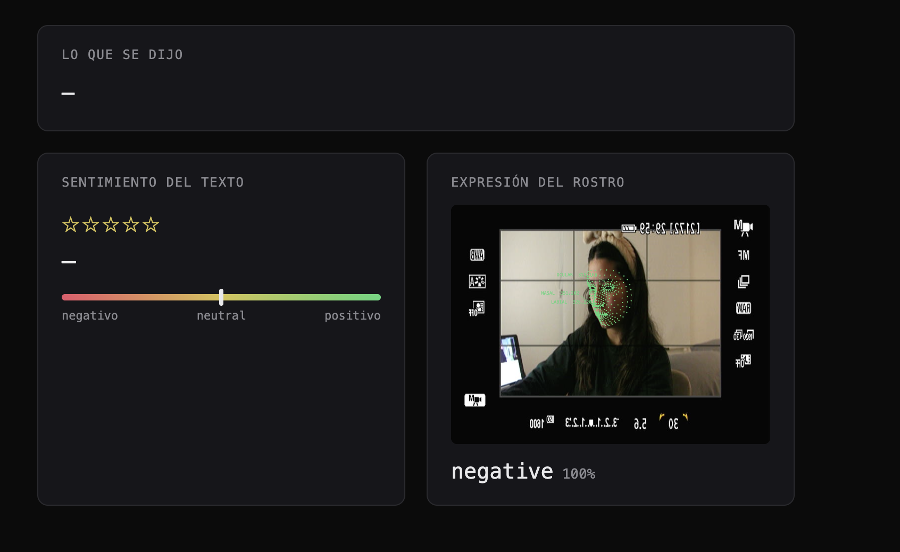

# rastro



Prototipo técnico para una tesis sobre vigilancia afectiva algorítmica: un
visitante habla frente a una cámara y un micrófono, y el sistema reduce ese
momento humano a categorías fijas — sentimiento del texto, expresión del
rostro, y una malla de puntos biométricos — en tiempo real.

> *"Esto que ven no es solo el resultado de una API, es la arquitectura del
> argumento — la conversación entera fue forzada a caber en una sola caja."*

## La idea

Amazon Comprehend, un modelo de sentimiento de 5 estrellas, un clasificador de
expresión facial entrenado a mano — cada uno impone su propia taxonomía fija
sobre la misma persona, en el mismo instante, y ninguna de esas taxonomías es
un hecho objetivo: es una imposición arbitraria tratada como si lo fuera. El
prototipo hace visible ese proceso mostrando varios sistemas de clasificación
corriendo en paralelo sobre la misma voz y el mismo rostro.

## Estructura del repo

```
emiSpeech/                     prototipo principal (100% navegador)
  index.html
  sketch.js
  style.css
  p5.min.js / p5.speech.js

rastro_pipeline.py             prototipo original: AWS Transcribe + Comprehend
contexto_prototipo_rastro.md   notas de configuración de AWS (checklist paso a paso)
comparacion_sentimiento.html   comparador standalone: Comprehend vs ml5.js sentiment
resumen_prototipo.txt          bitácora de decisiones y hallazgos técnicos
```

## `emiSpeech` — prototipo principal

Corre completamente en el navegador, sin backend ni credenciales de ningún
tipo. Combina tres sistemas de clasificación en vivo sobre la misma persona:

1. **Transcripción de voz** — Web Speech API (`p5.speech.js`), español
   (`es-CL`), con texto parcial en vivo mientras se habla.
2. **Sentimiento del texto** — [`transformers.js`](https://github.com/xenova/transformers.js)
   corriendo `Xenova/bert-base-multilingual-uncased-sentiment` (1 a 5
   estrellas, multilingüe), mapeado a positivo / neutral / negativo.
3. **Expresión del rostro** — [`ml5.js`](https://ml5js.org) (`imageClassifier`)
   cargando un modelo propio entrenado en [Teachable Machine](https://teachablemachine.withgoogle.com/)
   (positivo / neutral / negativo).
4. **Malla de puntos faciales** — `ml5.faceMesh`, ~468 puntos dibujados en
   vivo sobre el rostro, con lectura de coordenadas crudas — la reducción del
   rostro a datos, hecha visible.

### Cómo correrlo

Necesita servirse por HTTP (no abrir el `index.html` directo con doble click),
porque pide permisos de cámara/micrófono y carga un módulo de JS:

```bash
cd emiSpeech
python3 -m http.server 8000
```

Abrir `http://localhost:8000` en Chrome o Safari (no Firefox — la Web Speech
API no funciona ahí), y aceptar los permisos de cámara y micrófono.

### Hardware usado

- **Cámara:** Canon EOS T4i conectada vía capturador HDMI-a-USB (la T4i **no**
  es compatible con Canon EOS Webcam Utility, así que el capturador es
  obligatorio).
- **Micrófono:** Shure SM57 (dinámico, cardioide) → Arturia MiniFuse 2 (USB-C).

### Configuración

En `sketch.js`, al inicio del archivo:

```js
const TM_MODEL_URL = "...";      // URL del modelo exportado de Teachable Machine
const MIRROR_CAMERA = false;     // true solo si la fuente es una webcam tipo selfie
const SPEECH_LANG = "es-CL";     // idioma del reconocimiento de voz (BCP-47)
```

## `rastro_pipeline.py` — prototipo original (AWS)

Primera versión del prototipo: graba un audio, lo sube a S3, lo transcribe con
**Amazon Transcribe** (estándar, no Call Analytics — no aplica porque es 1
solo visitante, no una conversación de 2 canales), y analiza el sentimiento
con **Amazon Comprehend** (`BatchDetectSentiment`, forzado a 4 categorías fijas:
Positive / Negative / Neutral / Mixed). El paso a paso completo de
configuración de AWS (IAM, CLI, bucket S3) está en
`contexto_prototipo_rastro.md`.

```bash
pip3 install boto3
python3 rastro_pipeline.py
```

## Hallazgos técnicos (para quien retome esto)

- `ml5.sentiment` (modelo `MovieReviews`) es solo inglés — para español se usa
  `transformers.js` con un modelo multilingüe.
- Cargar `@teachablemachine/image` + `tfjs` junto con `ml5.js` genera
  conflictos de backend (WebGPU). Se resolvió usando `ml5.imageClassifier()`
  nativo, todo bajo un solo motor de TensorFlow.
- `ml5.faceMesh` carga su modelo de forma asíncrona — hay que esperar
  `faceMesh.ready` antes de llamar `detectStart()`.
- El canvas donde se dibujan los puntos debe coincidir con la resolución
  nativa del video (no un tamaño fijo arbitrario), y p5.js necesita que se
  fuerce su tamaño por CSS con `.style()` para que no se desalinee.
- Correr dos modelos de IA sobre video a resolución nativa (1080p+) satura el
  sistema — conviene pedir una captura más chica (ej. 480×360).
- Un modelo de Teachable Machine no generaliza entre cámaras distintas: si se
  entrenó con una cámara y se usa con otra, hay que reentrenar.

## Pendientes

- [ ] Reentrenar Teachable Machine usando la T4i como cámara fuente.
- [ ] Confirmar que el audio de `emiSpeech` está tomando el MiniFuse + SM57 y
      no el micrófono integrado del Mac.
- [ ] Barra de nivel de sonido en la UI, para saber cuándo se está hablando.
- [ ] Que la cámara ocupe todo el fondo, con los demás paneles superpuestos.

## Contexto

Prototipo desarrollado para la presentación de tesis (20 de julio, 2026). Este
repositorio documenta el desarrollo del prototipo técnico y la presentación.
